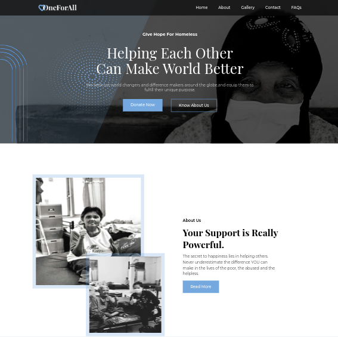

<div id="top"></div>

<div align="center">
  <h2 align="center">One For All</h2>
  <p align="center">
    <br />
    <br />
    <a href="https://one-for-all-org.vercel.app" target="_blank">View Demo</a>
    ·
    <a href="https://github.com/mahdipratama/one-for-all" target="_blank">Report Bug</a>
    ·
  </p>
</div>

<!-- Bagdes -->
<div align="center">
  <!-- Profile -->

  <!-- Status -->
  <a href="#">
    
  </a>

</div>

#

<div align="center">



</div>

## The Challenge

This React SPA project is built with <a href='https://nextjs.org/' target=_blank>Next.js</a> as its framework, the challenge is integrating with the <a href='https://stripe.com/en-gb-us' target=_blank>Stripe payment method</a> to process a donation from the website and displaying a different hero background on each separate page.
<br>
In addition, <strong>I challenged myself to connect the website to a <a href='https://www.mongodb.com/atlas/database' target=_blank>MongoDB database</a></strong> to store donation data and incoming messages from the contact form.

- Users should be able to:
  - Browse the website quickly and each page has a different hero background
  - Donate money with a customizable amount

<br>

## **What I learned**

* Handled the routing system with Next.js <a href='https://nextjs.org/docs/pages/building-your-application/routing'>file-based routing system</a> 
* Using `API routes` to enable the creation of `serverless functions` to handle `API requests`
* Created a function for establishing a connection to a <a href='https://www.mongodb.com/atlas/database' target=_blank>MongoDB database</a> using Mongoose, an Object Data Modeling (ODM) library for MongoDB, and a little bit of Node.js.
* Created schemas or models for interacting with the <a href='https://www.mongodb.com/atlas/database' target=_blank>MongoDB database</a> using Mongoose.
* Integrating the website into the <a href='https://stripe.com/en-gb-us' target=_blank>Stripe </a>payment method.
* A lot of minor things

<br>

<h2 align="center">Links</h2>

- Live Site URL: [https://one-for-all-org.vercel.app/](https://one-for-all-org.vercel.app/)

<br>

## Table of contents

 [](#)
  - [The Challenge](#the-challenge)
  - [Table of contents](#table-of-contents)
  - [My process](#my-process)
    - [Built with](#built-with)
  - [Instructions](#instructions)
  

## My process

### Built with
<!-- Bagdes -->


## Instructions

When using `Next.js` in order to build this project

- Install all dependencies:

```bash
npm install
```

- If you want to edit the code and test, in the root folder of this repository, run this command from the command line:

```bash
npm run dev
```


- Run build command from command line:

```bash
npm run build
```
